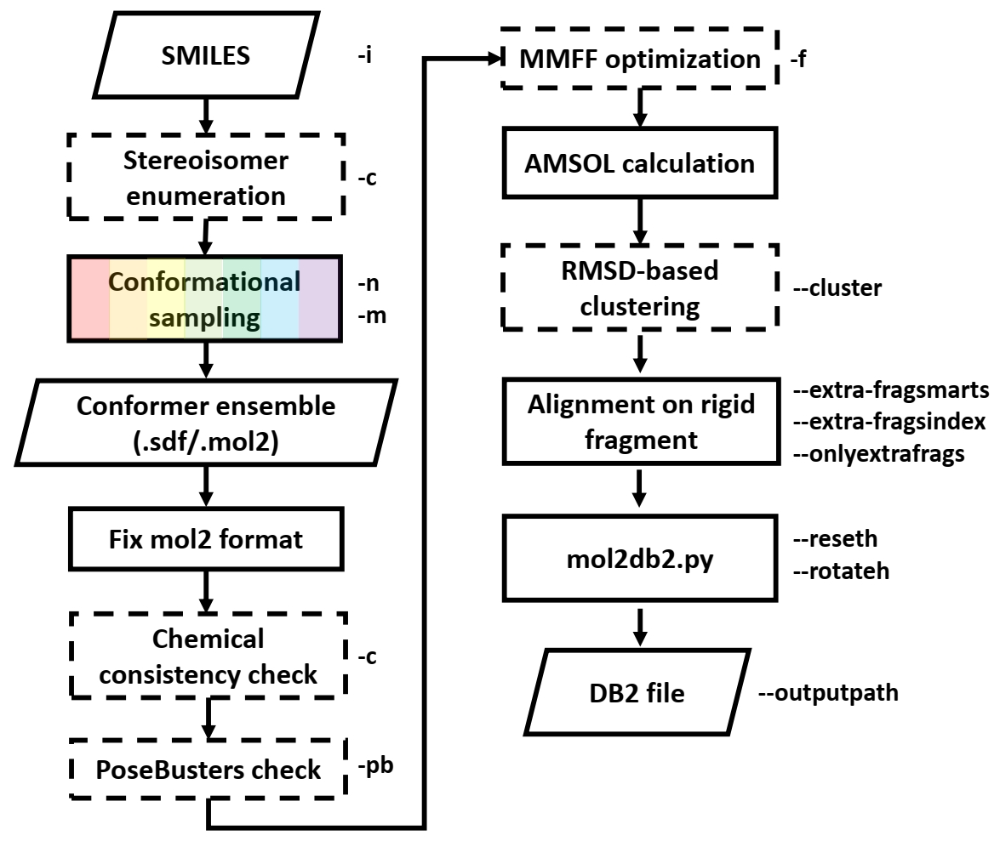

## db2_converter

**Use third-party sampling techniques to generate molecular conformers and collate them as a DB2-formatted file.**

Note that except for RDKit, all other sampling methods require a software license.
We recommend the use of Conformator and CCDC Conformer Generator.
- Supported sampling methods:
  - Academic-free:
    - **[Conformator (ZBH)](https://www.zbh.uni-hamburg.de/forschung/amd/software/conformator.html)**
    - [BCL::Conf (BCL)](http://carbon.structbio.vanderbilt.edu/index.php/bclcommons/show/b_apps_id/1)
    - [ETKDGv3+sr (RDKit)](https://github.com/rdkit/rdkit)
  - Commercially available:
    - **[Conformer Generator (CCDC)](https://www.ccdc.cam.ac.uk/support-and-resources/csdsdownloads/)**
    - [ConfGenX (Schrodinger)](https://my.schrodinger.com/download/software/)

Also, this workflow includes conversion between MOL2-format and SDF-format, which requires [UNICON](https://www.zbh.uni-hamburg.de/forschung/amd/software/unicon.html) software.



***
### How to use

#### Installation
```bash
git clone git@github.com:hnlab/db2_converter.git
cd db2_converter
conda env create -f db2_converter.yml
conda activate db2_converter
pip install -e .
```

#### Input example
A text file containing SMILESs and molecular names is needed as input of db2_converter. Here is an example of `input.smi`.
```text
[O-]C(=O)[C@@H](NC(=O)[C@@H](NC(=O)[C@@H]([NH3+])CCC([O-])=O)CC([O-])=O)CC(C)C 1a30
n1c2c(cc3c1cc(N)cc3)ccc(N)c2 1bcu
P([O-])([O-])(=O)C(F)(F)c1cc2c(cc(cc2)C(=O)N[C@H](C(=O)N)CCC([O-])=O)cc1 1bzc
[NH2+]=C(N)c1ccccc1 1c5z
Clc1cc2[nH+]c3c(c(N)c2cc1)[C@@H]4CC(=C[C@H](C3)C4)CC 1e66
O=C(N[C@H]1c2c(cccc2)C[C@H]1O)[C@H](OCc3ccccc3)[C@H](O)[C@@H](O)[C@@H](OCc4ccccc4)C(=O)N[C@H]5c6c(cccc6)C[C@H]5O 1eby
S1(=O)(=O)N([C@@H]([C@H](O)[C@@H](O)[C@H](N1Cc2ccccc2)COc3ccccc3)COc4ccccc4)Cc5cc(ccc5)C(=O)NC 1g2k
O=C1NC2=C(C=C1)[C@@]3([NH3+])/C(=C/C)/[C@H](C=C(C3)C)C2 1gpk
O=C1NC2=C(C=C1)[C@]34[NH2+]CCC[C@@H]3[C@@H](C=C(C4)C)C2 1gpn
O=C1NC2=C(C=C1)[C@@H]([NH2+]CCCCCCCCCC[NH2+][C@@H]3C4=C(NC(=O)C=C4)CCC3)CCC2 1h22
CCC(=O)N1CCC(CC1)NC(=O)Nc2ccc(cc2)OC(F)(F)F 4od0
```

#### Before using db2_converter
db2_converter relies on several third-party softwares either for sampling or format conversion. You need to modify the configuration dictionary in ***db2_converter/config.py*** to specify the correct software paths and settings. At least, `config["all"]["UNICON_EXE"]` should be replaced by the executable file of unicon before running the first example below. If you have not used UNICON before, please download it from [here](https://www.zbh.uni-hamburg.de/forschung/amd/software/unicon.html) and activate the license through `unicon --license=xxx`.

#### Run example
##### 1. Quick example
A quick example to see if anything is ready.
```bash
# Use db2_converter to generate db2 files of molecules from input.smi
## RDKit ETKDGv3+sr is used to sample 1 conformer for each molecule. And
## db2 files or mol2 files will be generated in the working directory and saved in output directory.
workingpath=example
outputpath=example
OMP_NUM_THREADS=1 build_ligand -i input.smi -n 1 -nr 1 -m rdkit --workingpath $workingpath --outputpath $outputpath
```

After running the above command, the script's installation path will first be displayed, followed by a prompt to update the paths of dependent third-party software.
```
#########################################################################
  ____   ____  ____                                        _              
 |  _ \ | __ )|___ \    ___  ___   _ __ __   __ ___  _ __ | |_  ___  _ __ 
 | | | ||  _ \  __) |  / __|/ _ \ | '_ \\ \ / // _ \| '__|| __|/ _ \| '__|
 | |_| || |_) |/ __/  | (__| (_) || | | |\ V /|  __/| |   | |_|  __/| |   
 |____/ |____/|_____|  \___|\___/ |_| |_| \_/  \___||_|    \__|\___||_|   

Packaged from:
 /path/to/db2_converter/db2_converter/build_ligand.py
Remember to modify the config file for the third-party softwares:
 /path/to/db2_converter/db2_converter/config.py

#########################################################################
```
Then, the script will display the combination of parameters used for this run.
```
{'insmi': PosixPath('input.smi'), 'workingpath': PosixPath('/your/working/directory'), 'outputpath': PosixPath('/your/output/directory'), 'max_conf': 600, 'keep_max_conf': False, 'max_conf_noring': 30, 'limitconf': False, 'samplopt': 'rdkit', 'checkstereo': False, 'PBfilter': False, 'MMFFopt': False, 'cluster': False, 'bcl_option': '', 'confgenx_option': '', 'extra_fragsindex': [], 'extra_fragsmarts': '', 'onlyextrafrags': False, 'reseth': False, 'rotateh': False, 'rerun': False, 'mergeiso': False, 'verbose': False}
```
Next, the script will output the third-party software and their respective paths required for this run, while also checking if these paths exist. If any dependency is not met, the script will terminate.
```
Config availability:
+-----------------------+------------------------------------------------------------------------------------------------------+-------------+
| name                  | value                                                                                                | available   |
+=======================+======================================================================================================+=============+
| BABEL_EXE             | /home/xiaqc/mambaforge/envs/basic/bin/obabel                                                         | True        |
+-----------------------+------------------------------------------------------------------------------------------------------+-------------+
| AMSOLEXE              | /data/git-repo/db2_converter/ligand/generate/db2_converter/db2_converter//amsol/amsol7.1_patched     | True        |
+-----------------------+------------------------------------------------------------------------------------------------------+-------------+
| ANTECHAMBER           | /home/xiaqc/mambaforge/envs/basic/bin/antechamber                                                    | True        |
+-----------------------+------------------------------------------------------------------------------------------------------+-------------+
| UNICON_EXE            | /home/xiaqc/soft/ZBH2022/unicon_1.4.2/unicon                                                         | True        |
+-----------------------+------------------------------------------------------------------------------------------------------+-------------+
```
##### 2. Recommended usage
db2_converter allows users to control the scale and quality of conformational ensemble and DB2 files.
Here the recommended options are given, where ccdc is used to sample 600 conformers for molecules with ring substructure and 30 conformers for those without ring, stereochemistry is checked for the conformers, and certain polar hydrogen positions are reset or rotated to generate more rotamers.
All the options can be modified based on your interest if you know what they do.
We recommend the use of ccdc or conformator as the sampling method.
```bash
# if you have access to ccdc
method="ccdc"
# method="confgenx" # elif you have access to confgenx
# method="conformator" # elif you have access to conformator
# method="bcl" # elif you have access to bcl
# method="rdkit" # otherwise, use rdkit, but can be time consuming!!!
workingpath=$(readlink -f $method)
OMP_NUM_THREADS=1 build_ligand -i input.smi -n 600 -nr 30 --keep_max_conf -m $method --workingpath $workingpath --outputpath $workingpath --checkstereo --reseth --rotateh
# If you've used confgenx/bcl/rdkit, it is recommended to add PoseBusters filter using --PBfilter option
# If you need MMFF optimization on the conformers, add --MMFFopt option
```

##### 3. Other options
| option | function
| -- | -- | 
| --dock38 | Gnerate DOCK3.8 formatted db2


#### Output example
Except for result conformation ensemble files (.db2.gz and .fixed.mol2) and outputed failling list(.faillist). Now a summary of generation results will be provided in the log file under your working directory:

```txt
ALL SUMMARY:
+--------+-------------+------------+--------+---------+--------------+----------+-------------+-----------+------------------------------------------------------------------------------------------------------------------+
| Name   | method      |   telapsed |   N_in | N_out   | N_out_rotH   |   N_ring | N_db2part   | FAILED    | SMILES                                                                                                           |
+========+=============+============+========+=========+==============+==========+=============+===========+==================================================================================================================+
| 1a30   | conformator |    29.4607 |    600 | 316     | 316          |        0 | 1           |           | [O-]C(=O)[C@@H](NC(=O)[C@@H](NC(=O)[C@@H]([NH3+])CCC([O-])=O)CC([O-])=O)CC(C)C                                   |
+--------+-------------+------------+--------+---------+--------------+----------+-------------+-----------+------------------------------------------------------------------------------------------------------------------+
| 1bcu   | conformator |     0.908  |    600 | 1       | 1            |        1 | 1           |           | n1c2c(cc3c1cc(N)cc3)ccc(N)c2                                                                                     |
+--------+-------------+------------+--------+---------+--------------+----------+-------------+-----------+------------------------------------------------------------------------------------------------------------------+
| 1bzc   | conformator |    13.2209 |    600 | 545     | 545          |        1 | 1           |           | P([O-])([O-])(=O)C(F)(F)c1cc2c(cc(cc2)C(=O)N[C@H](C(=O)N)CCC([O-])=O)cc1                                         |
+--------+-------------+------------+--------+---------+--------------+----------+-------------+-----------+------------------------------------------------------------------------------------------------------------------+
| 1c5z   | conformator |     0.8337 |    600 | 5       | 5            |        1 | 1           |           | [NH2+]=C(N)c1ccccc1                                                                                              |
+--------+-------------+------------+--------+---------+--------------+----------+-------------+-----------+------------------------------------------------------------------------------------------------------------------+
| 1e66   | conformator |     0.5061 |    600 |         |              |        1 |             | 1generate | Clc1cc2[nH+]c3c(c(N)c2cc1)[C@@H]4CC(=C[C@H](C3)C4)CC                                                             |
+--------+-------------+------------+--------+---------+--------------+----------+-------------+-----------+------------------------------------------------------------------------------------------------------------------+
| 1eby   | conformator |    10.494  |    600 | 21      | 1701         |        4 | 8           |           | O=C(N[C@H]1c2c(cccc2)C[C@H]1O)[C@H](OCc3ccccc3)[C@H](O)[C@@H](O)[C@@H](OCc4ccccc4)C(=O)N[C@H]5c6c(cccc6)C[C@H]5O |
+--------+-------------+------------+--------+---------+--------------+----------+-------------+-----------+------------------------------------------------------------------------------------------------------------------+
| 1g2k   | conformator |     3.6921 |    600 | 8       | 72           |        5 | 5           |           | S1(=O)(=O)N([C@@H]([C@H](O)[C@@H](O)[C@H](N1Cc2ccccc2)COc3ccccc3)COc4ccccc4)Cc5cc(ccc5)C(=O)NC                   |
+--------+-------------+------------+--------+---------+--------------+----------+-------------+-----------+------------------------------------------------------------------------------------------------------------------+
| 1gpk   | conformator |     1.9642 |    600 | 4       | 4            |        1 | 4           |           | O=C1NC2=C(C=C1)[C@@]3([NH3+])/C(=C/C)/[C@H](C=C(C3)C)C2                                                          |
+--------+-------------+------------+--------+---------+--------------+----------+-------------+-----------+------------------------------------------------------------------------------------------------------------------+
| 1gpn   | conformator |     2.2528 |    600 | 5       | 5            |        1 | 5           |           | O=C1NC2=C(C=C1)[C@]34[NH2+]CCC[C@@H]3[C@@H](C=C(C4)C)C2                                                          |
+--------+-------------+------------+--------+---------+--------------+----------+-------------+-----------+------------------------------------------------------------------------------------------------------------------+
| 1h22   | conformator |     3.3077 |    600 | 63      | 63           |        2 | 4           |           | O=C1NC2=C(C=C1)[C@@H]([NH2+]CCCCCCCCCC[NH2+][C@@H]3C4=C(NC(=O)C=C4)CCC3)CCC2                                     |
+--------+-------------+------------+--------+---------+--------------+----------+-------------+-----------+------------------------------------------------------------------------------------------------------------------+
| 4od0   | conformator |    15.6746 |    600 | 578     | 578          |        2 | 6           |           | CCC(=O)N1CCC(CC1)NC(=O)Nc2ccc(cc2)OC(F)(F)F                                                                      |
+--------+-------------+------------+--------+---------+--------------+----------+-------------+-----------+------------------------------------------------------------------------------------------------------------------+
```
| Field      | Meaning                                                  |
| ---------- | -------------------------------------------------------- |
| method     | sampling method                                          |
| t_elapsed  | time cost                                                |
| N_in       | $N_{max}$ conformers actually requested                  |
| N_out      | $N_{gen}$ conformers actually generated in mol2          |
| N_out_rotH | $N_{gen}$ * $N_{rot}$ rotamers actually generated in db2 |
| N_ring     | number of rings                                          |
| N_db2part  | number of hierarchies in db2                             |
| FAILED     | reason of failed generation                              |

| FAILED status   | FAIELD reason                                     |
| --------------- | ------------------------------------------------- |
| 1generate       | No conformers can be generated by sampling method |
| 2fixmol2        | No conformers left after fix mol2 format          |
| 3chemistrycheck | No conformers left after chemistry check          |
| 4PBfilter       | No conformers left after PoseBusters filter       |
| 5amsolfail      | AMSOL calculation of desolvation/charge failed    |
| 9nulldb2gz      | No db2 files can be generated by db2_converter    |

***
### NOTE
Some codes for modules such as AMSOL calculation and mol2db2 reference the workflow from [build3d38@TLDR](https://tldr.docking.org/start/build3d38), as mentioned in the [ZINC22 paper](https://pubs.acs.org/doi/10.1021/acs.jcim.2c01253).
### Citation
If you use this code, please cite:
- ***Xia, Q., Fu, Q., Shen, C., Brenk, R. & Huang, N. Assessing small molecule conformational sampling methods in molecular docking. Journal of Computational Chemistry (2024).***
- ***Tingle, B. I. et al. ZINC-22─A Free Multi-Billion-Scale Database of Tangible Compounds for Ligand Discovery. J. Chem. Inf. Model. 63, 1166–1176 (2023).***
- ***RDKit: Open-source cheminformatics. https://www.rdkit.org***
- ***Sommer, K. et al. UNICON: A Powerful and Easy-to-Use Compound Library Converter. J. Chem. Inf. Model. 56, 1105–1111 (2016).***

And also remember to cite the sampling method you opt to use:
- *Friedrich, N.-O. et al. Conformator: A Novel Method for the Generation of Conformer Ensembles. J. Chem. Inf. Model. 59, 731–742 (2019).*
- *Mendenhall, J., Brown, B. P., Kothiwale, S. & Meiler, J. BCL::Conf: Improved Open-Source Knowledge-Based Conformation Sampling Using the Crystallography Open Database. J. Chem. Inf. Model. 61, 189–201 (2021).*
- *Cole, J. C., Korb, O., McCabe, P., Read, M. G. & Taylor, R. Knowledge-Based Conformer Generation Using the Cambridge Structural Database. J. Chem. Inf. Model. 58, 615–629 (2018).*
- *Watts, K. S. et al. ConfGen: A Conformational Search Method for Efficient Generation of Bioactive Conformers. J. Chem. Inf. Model. 50, 534–546 (2010).*
